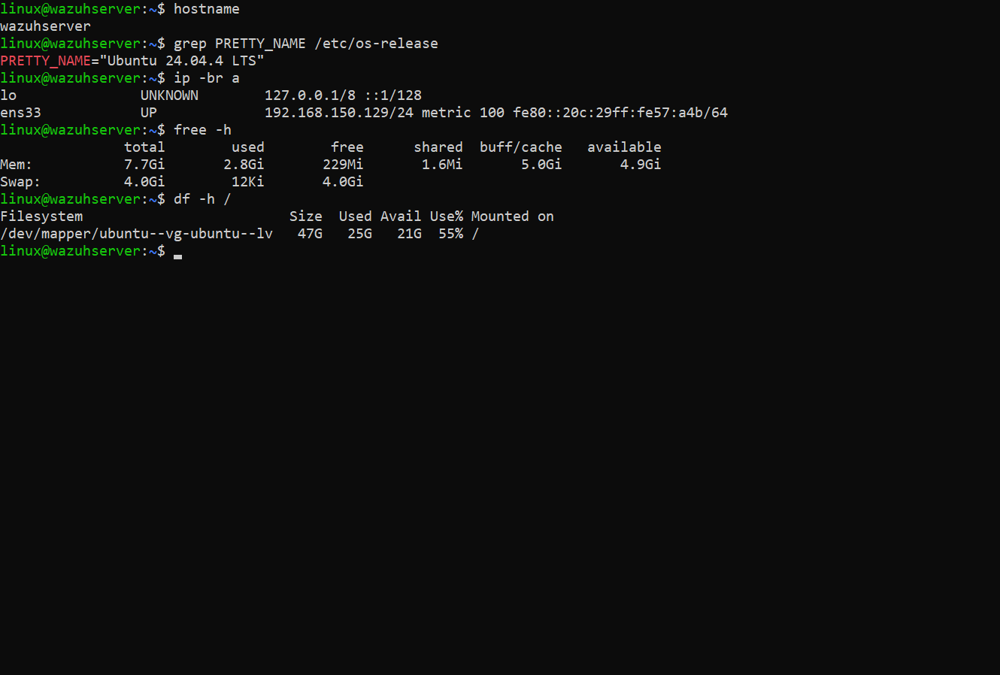
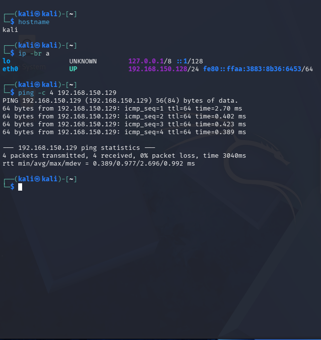
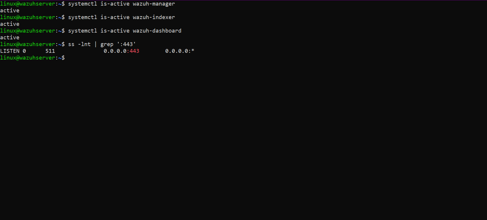
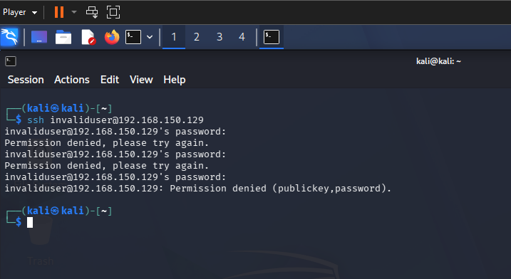
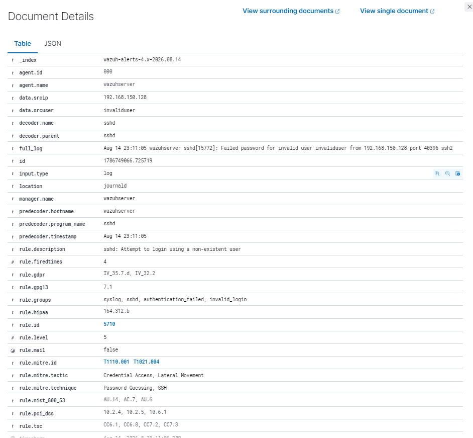
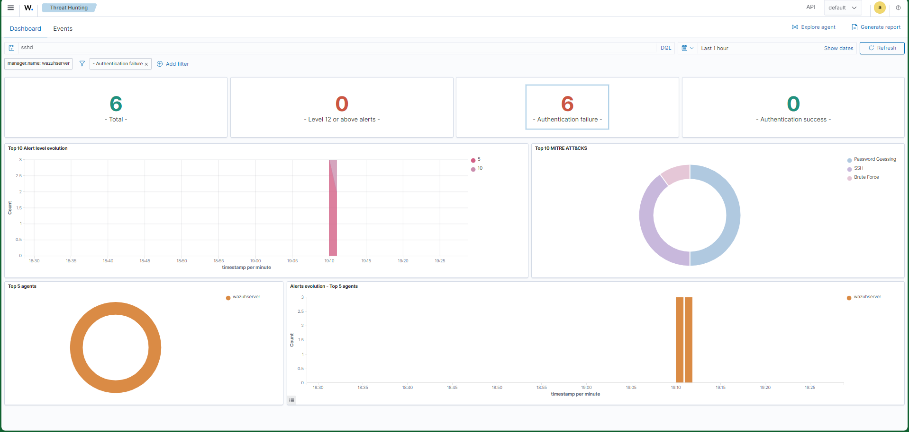
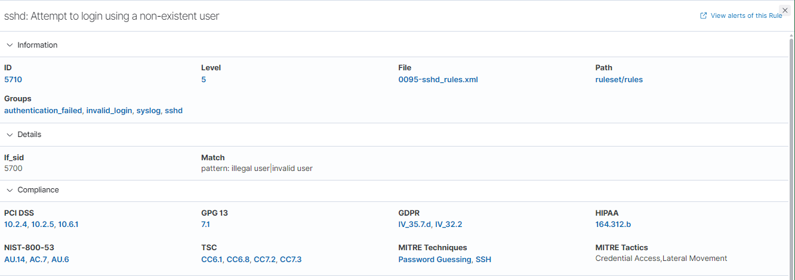

This is my first Wazuh lab.

I wanted to build something where I could actually generate an event and then follow it inside a SIEM instead of only reading about how detection works.

I used two virtual machines in VMware.

Kali Linux was my attacker machine.

Its IP was 192.168.150.128.

Ubuntu Server was running Wazuh and was also the SSH target.

Its IP was 192.168.150.129.

Before doing anything else, I checked if Kali could reach the Ubuntu server.

The connection worked and the ping completed with no packet loss.

After that, I checked the Wazuh services on the Ubuntu server.

The Manager, Indexer and Dashboard were all active.

Port 443 was also listening for the Wazuh dashboard.

Once I knew everything was working, I moved to Kali and tried to connect to the Ubuntu server over SSH.

I used a fake user called invaliduser.

ssh invaliduser@192.168.150.129

I entered the wrong password a few times until the connection was denied.

Then I went back to Wazuh to see if the activity had been detected.

The failed SSH attempt showed up in Threat Hunting.

The source IP in the event was 192.168.150.128, which was the Kali machine I used for the test.

The event also showed the user invaliduser and the sshd decoder.

Wazuh triggered Rule 5710 with alert level 5.

I also filtered the dashboard to look only at authentication failures.

That made it easier to see the failed SSH activity from the test.

After finding the alert, I opened Rule 5710 to understand what actually caused it to trigger.

The rule is used for SSH login attempts with a user that does not exist.

Wazuh also mapped the activity to Password Guessing and SSH in MITRE ATT&CK.

The related tactics were Credential Access and Lateral Movement.

It was a simple test, but it helped me understand the whole process better.

I generated the activity myself, found it in Wazuh, checked the source IP, looked at the original SSH event and then checked the rule that detected it.

I want to keep using this lab to test more attacks and see how Wazuh reacts to them.
